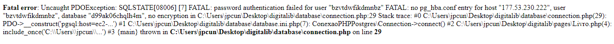
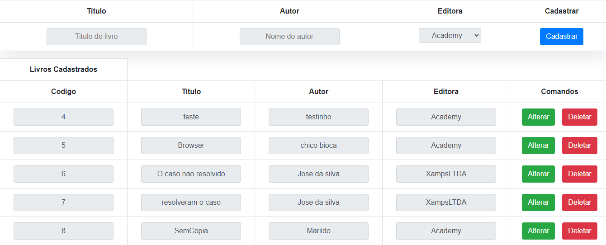
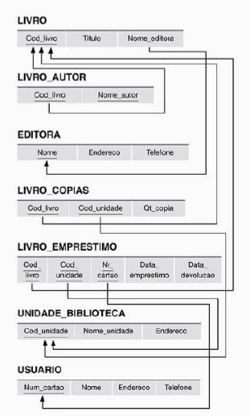

# Introdução à DigitalL

Trabalho desenvolvido na disciplina de Banco de Dados no ano de 2022 na Universidade Federal do Tocantins - UFT usando PHP.

## Fazendo funcionar

1 - Criar a base de dados por meio do script SQL disponivel.

2 - Com o PHP instalado basta rodar o servidor local no diretório do projeto. Para isso usa-se o comando:

`php -S localhost:XXXX`

onde XXXX é a porta que deseja rodar.

LEMBRE-SE DE ALTERAR AS CREDENCIAS DE CONEXÃO COM O BANCO DE DADOS, CASO CONTRÁRIO PODE SE DEPARAR COM PROBLEMAS DO TIPO:

# Sobre

Uma das minhas primeiras criações quando se trata de projeto, a atividade deu foco à introdução ideia/noções de backend fora alguns conceitos trabalhados a parte. Aplicação simula um controle bibliotecário dando vida às entidades do nosso banco de dados.

Permitindo assim, realizar operações do tipo CRUD referente aos objetos trabalhados.

### Demonstração:

A título de exemplo, a entidade que representa os livros pode ser controlado por meio da aplicação no caso de um cenário hipotetico de biblioteca em que esse tipo de controle se torna necessário.

Sendo assim, é possivel:

- Cadastrar um novo livro.

- Alterar informações de um livro posterior a sua criação.

- Remover um livro da base de dados.

No caso, vai se deparar com o seguinte esquema de banco de dados:

## Práticas exercicitadas

`Banco de dados`

`Models & Controllers - Padrões de projetos`

`Introdução à POO`
